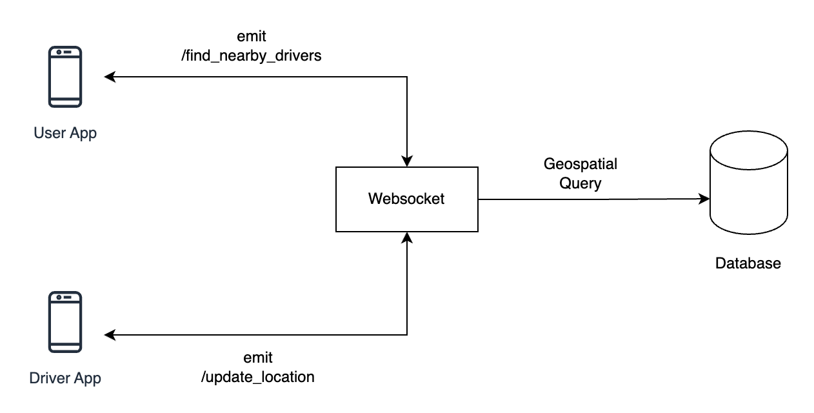

# Spatial Index for Real-time Location Search
## Spatial Index Overview

The application leverages MongoDB's Geospatial Queries through the implementation of a 2dsphere spatial index. This index is specifically designed for geospatial data and supports efficient querying of spatial relationships between geometric shapes. In this case, it is applied to the `location` field in the MongoDB collection, allowing for optimized location-based searches.

### MongoDB Geospatial Queries

MongoDB Geospatial Queries enable the execution of spatial queries on the indexed geospatial data. The `$near` operator is particularly valuable, allowing the system to find documents whose location is near a specified point. In the context of this application, it is used to identify nearby drivers within a given distance from a user's location.

## Applying Spatial Index in Location Search

When a client emits a 'find_drivers' event, the system uses MongoDB's Geospatial Queries to efficiently locate drivers near the specified coordinates. The spatial index enhances the speed and precision of these queries, making location-based searches, such as finding nearby drivers, a streamlined process.

## Real-Time System

The real-time functionality of the system is facilitated by Flask-SocketIO. Clients can seamlessly connect, disconnect, and receive updates in real-time. The 'update_location' event enables clients to transmit real-time location updates for a specific driver, and the system broadcasts these changes to all connected clients.

## App Flow
<div align="center">

</div>

1. **Client Connection:**
   - Clients connect to the server using WebSocket.
   - Upon connection, the server prints a message indicating the client connection.

2. **Update Driver Location:**
   - Clients can emit the 'update_location' event with a driver's ID, latitude, and longitude.
   - The server updates the driver's location in the MongoDB collection and notifies the client of the success or failure.

3. **Find Nearby Drivers:**
   - Clients can emit the 'find_drivers' event with their location (latitude, longitude) and a scan distance.
   - The server performs a spatial query using the 2dsphere index to find nearby drivers and emits the result to the client.

4. **Client Disconnection:**
   - Clients can disconnect from the server, and the server prints a message indicating the disconnection.

## How to Run

1. **Install Dependencies:**
   ```bash
   pip install -r requirements.txt
   ```

2. **Seed Drivers:**
   ```bash
   python seed_drivers.py
   ```

3. **Run the Application:**
   ```bash
   python app.py
   ```

4. **Access the App:**
   Open a web browser and go to [http://localhost:5000/](http://localhost:5000/).

## Tests

### Running Tests

Execute the following command to run the test suite:

```bash
pytest tests/
```

## Project Structure

Below is an overview of the key directories and files:

- **`app.py`**: The main Flask application file where the server is initialized, and SocketIO events are handled.
- **`seed_drivers.py`**: A script to seed sample driver data into the MongoDB database and create the 2dsphere spatial index
- **`test/`**: Directory containing test files.
    - **`test_app.py`**: Contains unit tests for the Flask application

- **`./requirements.txt`**: Contains a list of Python packages and their versions required for the project. Install dependencies using `pip install -r requirements.txt`.

Feel free to customize the project structure based on your preferences and additional requirements.