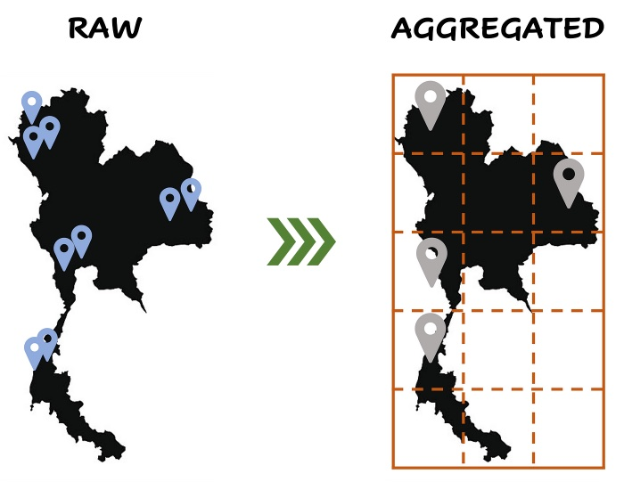
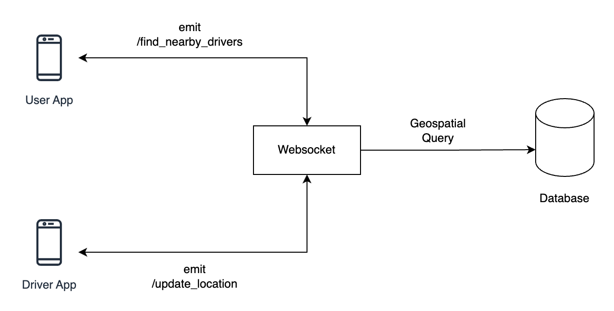

# Real-time Location Search with Spatial Index
A Real-time Location Search demonstration for driving booking app with efficient nearby drivers finding using Flask, Socket.IO, and spatial indexing for optimal performance and accuracy.
## Concepts Overview
### Geo-Spatial Data

Geo-spatial data refers to information that identifies the geographical location of physical objects, features, or observations on the Earth's surface. It encompasses various data types, including coordinates, shapes, distances, and metadata related to geographic features.

### Geo-Spatial index
A Geo-Spatial index, also known as a spatial index, is a data structure specifically designed to efficiently store and query spatial data in databases. It's used to optimize the retrieval of information related to geographic locations or spatial objects. Geospatial indexes organize spatial data in a way that makes it quicker to perform spatial queries, such as finding nearby points, determining contained or intersecting regions, or conducting distance-based searches.
<div align="center">

</div>


### MongoDB's Geospatial Capabilities

MongoDB, a NoSQL database, provides robust support for handling Geo-spatial data through dedicated Geospatial Indexes and specialized query operators. The 2dsphere index specifically handles geographic coordinates represented as GeoJSON objects. It uses a geohash-based grid structure to quickly index and retrieve spatial data, considering the Earth's curvature. 

#### Geospatial Query Operators in MongoDB

- **`$near`:** Finds objects near a specified point.
- **`$geoWithin`:** Selects objects within a specified area.
- **`$geoIntersects`:** Selects objects that intersect with a specified GeoJSON object.

For more information about MongoDB's 2dsphere index, please refer to this article: https://www.mongodb.com/docs/manual/core/indexes/index-types/geospatial/2dsphere/

### Benefits of Spatial Indexing

The implementation of a 2dsphere spatial index in MongoDB brings several advantages:

- **Efficient Queries:** The index enhances query performance for Geo-spatial data, enabling rapid retrieval of objects based on their proximity to specific locations.
- **Optimized Spatial Relationships:** Enables querying of complex relationships between geometric shapes (e.g., finding points within a certain distance of a polygon).
- **Streamlined Real-time Updates:** Facilitates real-time updates and queries for location-based information, crucial for applications requiring dynamic location tracking and retrieval.


## Applying Spatial Index in Real-time Location Search

When a client emits a 'find_drivers' event, the system uses MongoDB's Geospatial Queries to efficiently locate drivers near the specified coordinates. The spatial index enhances the speed and precision of these queries, making location-based searches, such as finding nearby drivers, a streamlined process.

## Real-Time System

The real-time functionality of the system is facilitated by Flask-SocketIO. Clients can seamlessly connect, disconnect, and receive updates in real-time. The 'update_location' event enables clients to transmit real-time location updates for a specific driver, and the system broadcasts these changes to all connected clients.

## App Flow
<div align="center">

</div>

1. **Client Connection:**
   - Clients connect to the server using WebSocket.
   - Upon connection, the server prints a message indicating the client connection.

2. **Update Driver Location:**
   - Clients can emit the 'update_location' event with a driver's ID, latitude, and longitude.
   - The server updates the driver's location in the MongoDB collection and notifies the client of the success or failure.

3. **Find Nearby Drivers:**
   - Clients can emit the 'find_drivers' event with their location (latitude, longitude) and a scan distance.
   - The server performs a spatial query using the 2dsphere index to find nearby drivers and emits the result to the client.

4. **Client Disconnection:**
   - Clients can disconnect from the server, and the server prints a message indicating the disconnection.

## How to Run

1. **Install Dependencies:**
   ```bash
   pip install -r requirements.txt
   ```

2. **Seed Drivers:**
   ```bash
   python seed_drivers.py
   ```

3. **Run the Application:**
   ```bash
   python app.py
   ```

4. **Access the App:**
   Open a web browser and go to [http://localhost:5000/](http://localhost:5000/).

## Tests

### Running Tests

Execute the following command to run the test suite:

```bash
pytest tests/
```

## Project Structure

Below is an overview of the key directories and files:

- **`app.py`**: The main Flask application file where the server is initialized, and SocketIO events are handled.
- **`seed_drivers.py`**: A script to seed sample driver data into the MongoDB database and create the 2dsphere spatial index
- **`test/`**: Directory containing test files.
    - **`test_app.py`**: Contains unit tests for the Flask application

- **`./requirements.txt`**: Contains a list of Python packages and their versions required for the project. Install dependencies using `pip install -r requirements.txt`.

Feel free to delve into the code and make adjustments to suit your specific requirements. If you encounter any questions or issues, don't hesitate to reach out. Happy coding!
